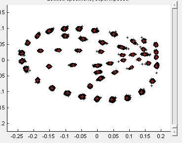

**Instruction guide for the DworkinLab TPSdig -> WingMachine -> CPReaderer workflow**
===

Greetings future DworkinLab member! This guide is intended to walk you through the latest version of our workflow for turning wing images fresh off the 'scope into landmark and semilandmark coordinate data. Conceptually, we are doing this to the images:

This workflow involves a number of different bits of software and can be irritating the first time through – please read along as you go if you're new since missing one of the early steps will force you to backtrack which can be frustrating.

I've tried to streamline things as much as possible and to document the problems that people have told me about in the troubleshooting section. If you're using the system them *please* feel free to add to this document so that you successors can learn from your experience of bugs/crashes/errors etc.

Happy Splining!

Dr. Will Pitchers and Dr. Ian Dworkin

## Step 0. Prepare your images
---

Before you begin to landmark, spline etc. make sure that your images are all in .tiff format and named sensibly and uniquely; i.e. something like 'thistest_M13_R_d3_WP.tif' for the right wing of male #13 from day 3 of Will Pitchers' 'thistest' experiment.  a *readme.txt* in each folder of images to document the nomenclature of your filenames is required!

INSERT IMAGE SCALING

1 - Make sure the photos to spline are copied to the C: drive (currently C:\Will_WM_RAL_test)
  NB- make sure that folder & file names contain no spaces!

2 - Resize images to 632 x 480 pixels for LANDMARKING - save as greyscale TIFs

3 - Resize images to 316 x 240 pixels for SPLINING - save as greyscale TIFs

4 - Landmark the 632 x 480 images - Humeral break, then Alula notch. Save the results file with the 632 x 480 images.
  NB- remember to set scale to pixels ('px') as opposed to mm
  AND: make sure that ImageJ doesn't spool all the way through and have you re-landmark from the first file again!

5 - Run the Python script 'wingmachine_2.1' and direct it to your results file. Scale will depend on the microscope you have used. It is in mm/pixel. Importanly the scale needs to be calculated for the landmarking images (632x480).
  Name the output file Results.asc and drop it into the folder with images to spline.

### Notes on resizing images (and converting to greyscale).
- You can use the batch converter in GIMP to resize the images, and to convert to greyscale.
- You can also do batch conversion for size and greyscale in imageJ/fiji (tutorial to be written, but ask Ian).
    - ImageJ can also do batch cropping (which can be useful, but dangerous).
    - ImageJ batch conversions seems slower and requires more memory (so do wings in batches).

## Step 1. TPSdig
---

First up you'll need to launch **tpsUtil** and set up an empty .tps file. Opening **tpsUtil** give you a small window with a few options (see below). Select 'Build tps file from images' from the *Operation* drop-down menu. Click the 'Input' button and navigate to the folder containing your wing images, select any image and click 'Open'. Click the 'Output' button, check that you are in the same folder as your images, and give your .tps file a sensible name and click 'Save'. Click the 'Setup' button and make sure that the 'Include path?' checkbox is *not* checked before clicking 'Create'. You are now ready to landmark your images, click 'Close' to exit **tpsUtil** and boot up **tpsDig**.

Click the 'File' drop-down menu (top left) and select 'Input source' > 'File' and select the .tps file that you made a few moments ago. The first wing image in your folder ought to appear in the **tpsDig** window. While working in **tpsDig*** the 2 red arrows at the top left can be used to navigate between images, or you can use the left and right arrow keys on the keyboard, or you can tap the spacebar to advance to the next image. Alternate-clicking on the image will change the cursor into a crosshairs; this is the tool you will use to select landmarks. The first landmark should be placed at the top of the wing hinge, in the 'humeral break' in the costal vein. The second landmark is at the bottom of the wing hinge, in the crook of the 'alula notch'. The order of the landmarks is important – if you landmark them in the wrong order you will have to come back and fix it later.

Should you find a wing image that is unsuitable for splining, e.g. it is damaged or folded, you can remove it from the dataset at this stage by clicking 'Edit' > 'Delete current specimen'. If you find one or two images that problematic due to alignment or contrast etc. you *can* fix then one at a time using 'Options' > 'Image tools' > 'Tools', but this is slow and is not recommended for more than a very few problem images.

When you have landmarked all your images (or you have reached the end of a session and need to finish later) save the .tps file by clicking 'File' > 'Save data' > 'Save'. You will need to confirm the overwriting of the original file with the updated one.

Next, open the folder that contains your images and your .tps file and copy into it the script **WingMachineTPS2.py** (which you ought to find in the 'C:/waiting_wings' folder). Run **WingMachineTPS2.py** and answer the prompts that appear in the terminal window:

- 'The File you want to fix' – *your_landmark_file.tps*
- 'What you want to name the fixed file' – *your_landmark_file.asc* (note the *.asc* suffix)
- 'Your Name' – which you ought to know!
- 'Species' – this will most likely be *melanogaster*, we usually shorted to 'mel'
- 'Sex' – 'M' or 'F' if your images are all 1 sex, 'MF' if they are a mix
- 'Scale' – expressed in mm/pixel and written using digits only.

Once the script runs, you will have a .asc file. This is plain text so that you can open it in any text editor to check that it is correctly formatted. The .tps is on the left, with the .asc on the right:

Once you have your *.asc*, copy it into the directory that holds your small (splining size) images and you should be ready to WingMachine.

## Step 2. WingMachine
---

When you launch **WingMachine** you may see a warning window (e.g. below) about letting 'Java runtime environment' make changes to your computer. You will need to approve this in order for **WingMachine** to run.

After **WingMachine** launches you should see a window like this:

NB: To work, **WingMachine** needs 3 things; a set of images at splining size (316 x 240 pixels), a correctly-formatted *.asc* file to go with them, and the correct support/reference files. You must direct the program to these. Click *Select working directory* (1.) and navigate to the folder that contains your splining size images and your *.asc* file. Hitting *Select* should now  populate the *ASC file* filed and automatically generate the files in the *Log File* and *NTS file* fields. **WingMachine** now knows where your images, your *.asc* file, and most of the support files are. The last thing to provide is a *.cp2* or *.cp0* (template) file – click the '...' button next to the *Known master '.cp#' files* window (2.) and navigate to *C:/waiting_wings/* where you ought to find *Melanogaster.cp0* and *Melanogaster2.cp2* to get you started. Selecting both should give you the best shot at successful splining straight away. Once these file(s) are listed in the *Known master '.cp#' files* window you must click on them/it such that they/it turn blue, since otherwise the splining won't run.

To start splining, I advise clicking the *Fraction to be splined* button (3.) and select 0.01 – 0.02 before clicking the *Start splining* button. This will spline a subset of your images such that you can check that your settings work well without having to wait for the entire set to spline, which can take a good few minutes for large image sets. After a splining run completes, the spline checking window will open:

Use the *next* and *previous* buttons to scan through the fit of the splines. The above example is a good example, and if you see lots of images that look similar then you are in very good shape. However, sometimes you will see a bunch of wings that look more like this:

If more than a few wings look more like the 2nd example then I recommend adjusting the setting sliders (in the green box) and starting the splining over again, since manually fixing poorly fitting splines is the most time-consuming part of this process. The best bit of guidance I can give you is to make small changes to the sliders before larger ones, and try changing the sliders in descending order as they appear on the screen. If you get an error message about a missing support file then click *edit* (2b.) > *Preferences* and make sure that all four files are identified – they should be in these exact locations:

Once you get a subset of images to spline well, then change the *Fraction to be splined* option to 1.0 (i.e. all of the images) and hit *Start splining* again. After the process completes you will be presented with the spline checking window again, in addition to a message telling you how many wings splined successfully. If you're getting <95% success then you can probably do better by playing with the settings. In most cases 100% *is* possible – see troubleshooting tips below.

Once you have set of splines fitted, you need to check your splines for errors. **WingMachine** *does* have an automatic error-detection feature, which you can use by clicking the *Edit wings* button, but this is ***not*** an adequate replacement for checking *all* your splines with your own eyes. To do this the right way you should click the *Edit manually selected splines* button and select *all* your images in the right-hand box, move then across to the left hand box with the arrow button and then click *Add/update*. **WingMachine** will warn you that it is about to show you '10 good' individuals. Click *OK* and you will see the spline fixing window. Immediately click *finished* because the 'Good individuals' window is not useful in practice (though note that you can often find very poorly splined wings here – this is why you should *not* trust **WingMachine** to do your quality control!).

Another spline fixing window will now appear with the title 'Wrong individuals'. Here is where you need to find and fix any splining errors. As mentioned this is the time-consuming part of the process, but the good news is that **WingMachine** saves each edit when you move from one image to the next using the *>* button (in the middle at the bottom of the window), so if you cannot complete the set in one session you can stop part-way and pick it up at a later time by making a note of the image name and number from the title bar and hitting *finished*.

The spline fixing window allows you to manually adjust any of the 9 splines by clicking and dragging the control points (coloured circles) of the appropriate colour. I suggest making small movement close to parallel with the spline when a small adjustment is called for, since moving the control points perpendicular to the spline will alter the spline by a larger amount. If the spline configuration is pretty close to fitting the wing, then manually fixing small errors will be the most efficient way to proceed. If the splines are a poor fix (i.e. anywhere near as terrible as the bad example above) I advise you to click the *respline* button in the bottom left corner, which will give you this resplining window:

You now need to adjust 1 (or more) sliders on the main **WingMachine** window, then click the *Respline this image* button to refresh the resplining window. You can do this as many times as you wish, but if you spend >5mins with one image and don't get a successful fit then I advise giving up and fixing it manually. When you have finished resplining you should click the *Finished resplining* button and you should be returned to the spline fixing window. You can now make any required fine adjustments before moving on to the next image.

When you have finished your image set, or have run out of time for your current session, click *finished* in the bottom right and close **WingMachine**.

While you're editing the splines, **WingMachine** will update the *.cp* files that hold the individual data. Each time you edit a spline and move to the next image a copy of the *.cp* file will be saved with a numeric suffix e.g. *wing1001.cp* –> *wing1001.cp.1*. As you edit you will therefore be increasing the number of files in your splining folder; do not be concerned, since **CPR** is smart enough to disregard all but the newest *.cp* file for each individual when you come to superimposiny your splines.

## Step 3. CPReaderer
---

Launching **CPR** will first open a DOS terminal window, and there may be some delay before the GUI window appears – this is normal, so don't panic. When the GUI appears it ought to look like this:

Select your desired output location using the *Output Folder* button (top left), and check that the *Use all points* radio button is checked right below it.

Now click on the *Input Folders* button and point **CPR** at the location of your spline (.cp) files. The *Inc. subfolders* checkbox is checked by default, but isn't necessarily a good idea; if checked, this box causes **CPR** to check the contents of any folders inside the selected input folders, but only 1 folder down the file-tree. This means that if you select your *ToSpline* folder and leave *Inc. subfolders* checked, then any splines in the *temp* or *rejects* folders that **WingMachine** sometimes makes will be included.

Thus far I have had no reason to change the default settings in either the *Curve Sampling* or *Univariate Data* boxes, so please feel free to leave these alone.

Now you are ready to superimpose your wings. Click the green *Sample curves* button at the top in the middle panel. Generally speaking, if your wings have been dissected and mounted well then you probably not need to check the *Check for SCALE outliers* or *CP orientations are not uniform* boxes. If your images were captured on another lab's microscope setup then you might want to check *Check for SCALE outliers*, and if you have wing images with the wings pointing in both directions then you **need** to check *CP orientations are not uniform* – however, these options do cause the superimposition and sliding steps to take longer, dramatically longer for large (1000's of wings) datasets.

In the latest version of **CPR** (1.12r) Eladio has implemented a progress bar to reassure you that the program is actually working rather than hanging. Since some superimpositions take a long time it can be difficult to be sure that the program has not crashed. If you're using an older version then I reccomend that you launch the Windows Task Manager and open the Performance tab. You can then be reassured that **CPR** isn't hung up as long as the *CPU Usage History* graphs are moving.

Once the superimposition is complete, the plot window on the left hand side will show a wing outline like this:

In the *Plot control* box below the plot window the *Show curves*, *Landmarks* & *Semilandmarks* checkboxes can be used to add/remove features from the plot. The *TPS* and *EBS* radio buttons will replace the curve visualisation with a parrot plot based on either a thin-plate spline or an elastic-body spline respectively. Once you have amused yourself with the plotting options, you are ready to slide the semi-landmarks. Click the down slider on the plot window to show the view of the superimposed landmarks of the whole set of wings. This should look like this:

Note that the semi-landmarks along the veins and outline are currently round-ish clouds. When you click the green *Slide pseudolandmarks* they program will helpfully pause without giving you any indication that it is working for an extended period of time (If concerned I suggest using the task manager as above). Once the sliding is done, the plot should look like this:

Note that now the semi-landmark point-clouds are now almost 1-dimensional. If your splining was perfect then you could simply write out your data at this point, but **do not do this!**. It is virtually certain that there are outliers/errors that you need to check. To do this, click the yellow *Perform PCA* button in the middle panel. **CPR** will default to plotting PC1 against PC2, but you can use the *X* & *Y* drop-down menus to display other PCs. When you click the button, or select other PCs, a new window will pop open, that should look like this:

Use these plots to search for outliers that may be in error. Each red cross represents a specimen, with the ones nearest the mean being left unlabelled to avoid the visualisation being unreadable. A good rule of thumb is that a wing that has been really poorly splined, or one that did not get checked, is likely to bias the direction of one the first 10 PCs by not being at all wing shaped. For example, in this set I would start by checking wing #828. To do this, use the slider on the side of the plot window on the left of the main **CPR** GUI window to move up/down the list of wings until the label above the plot reads '828'. Here, this wing looks like this:

Note that in this example wing #828, though it does look like a somewhat rounded wing, is believably wing-shaped. This ##INSERT REAL BULLSHIT EXAMPLE HERE##

I recommend visually checking at least the first 10 PCs in this fashion, but in practice this step can expand to fill any time you have available to work on it. If you have spent a bunch of time rearing, dissecting, imaging and splining your wings it is worth spending a few hours error-checking – you do not want to have to come back and re-do everything once you find errors after doing your analyses! Once you have checked a sufficient number of wings to convince yourself that you've found all the problems in your dataset, the only thing left to do is remove the spurious landmark that exists to allow for the sliding of the semilandmarks on vein L4. Hit the *Remove SLM* button in the bottom left (this is red in the current version, but I recall it being yellow or orange previously). This will open a new window, and also add numbers to the current image in the main plot window. It should look like this:

On the current version of **CPR** the landmark that needs to go is numbered '38', though in previous version it was numbered '36'. To avoid confusion, the landmark to remove is this one:

Now you can write out the data by clicking the blue *Save all outputs* button in the middle panel. This will write five .dat files to your selected output folder; these will be called:

- Output_Landmarks.dat
- Output_Outline.dat
- Output_Landmarks+Veins.dat
- Output_Landmarks+SoftPoints.dat
- Output_Landmarks+Veins+Outline.dat

These are pretty self-explanatory, but the only one you really need is 'Output_Landmarks+Veins+Outline.dat' as it contains *all* the data. I advise changing the name of this file immediately to something sensible that identifies the dataset. Each row will be identified by the filename of the image, and will contain a bunch of reference variable, then all 96 landmarks & semi-landmarks, and finally the centroid size. Centroid size is measured in pixels by **CPR**, so remember to use the scale that you measured from one of your images to turn that into millimeters before doing anything with it. From here on out, all is analysis and (attempted) interpretation; good luck!

---

###Appendix I. Installing the Software (ID: Needs to be updated(
---

**Gimp** can be downloaded from http://www.gimp.org/ and it becomes *way* more useful if you also install David's Batch Processor from http://sourceforge.net/projects/gimpdbpplugin/.

**tpsDig2** can be downloaded from http://life.bio.sunysb.edu/morph/morphmet/tpsdig2w32.exe – just run the *.exe* file to install (windows system only).

I have left a *.zip* archive containing all the necessary files to get **WingMachine** and **CPR** up and running....

###Appendix II. Troubleshooting common issues
---

**WingMachineTPS2.py** script fails – commonly due to extra lines or landmarks in the *.tps* file. Open the *.tps* file with any text editor and search for "LM=0", "LM=1" or "LM=3": any of these strings will indicate an image with too many/few landmarks which will crash the script. Any entirely empty line in the *.tps* file will also cause a problem.

**WingMachine** fails to spline – check that the directory wherein your images live contains no spaces or special characters. This means the entire path: "C:\waiting_wings\mywings" will work but "C:\waiting_wings\my wings" will fail. Similarly, directory paths that are too long will cause the program to fail; try to keep your folders close to the "C:\". The error message in the **WingMachine** log window will usually be "wingsio.exe failed to exit".

**WingMachine** appears to ignore some images, or splines 0 of your images – sometimes this can be the result of your images being saved in a RGB colourspace rather than the Greyscale colourspace that **WingMachine** expects. Check the file sizes of your resized images; the 316 x 240 sized images should be ~75KB in size, over 100KB is a warning sign. You can fix this with **Gimp** or your image editor of choice.
